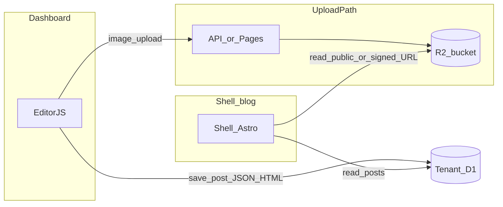

# Sprint planı — test kabuğu kapanışı, operasyon, sonraki blog sprint’i

**Amaç:** “Test kabuğu” fazını dokümante kapatmak; güvenlikte **yeni hardcode yok**, kritik davranışlar **env + Cloudflare Dashboard** ile yönetilsin. Ardından **SEO dostu blog + R2 medya** için ayrı sprint özeti (uygulama bu belgenin dışında kodlanır).

**İlgili dosyalar:** [PROJECT-STATUS.md](../PROJECT-STATUS.md), [ENV-VARIABLES-CHECKLIST.md](./ENV-VARIABLES-CHECKLIST.md), [api/README.md](../api/README.md).

---

## A — Test kabuğu kapanışı (operasyon + güvenlik)

### A1 — Env checklist

1. [docs/ENV-VARIABLES-CHECKLIST.md](./ENV-VARIABLES-CHECKLIST.md) dosyasını açın.
2. **API Worker** ve **Landing Pages** tablolarında her satır için Production (ve gerekiyorsa Preview) ortamında değerin tanımlı olduğunu doğrulayıp kutuları işaretleyin.
3. **`CORS_ORIGINS`:** Özel landing alanı kullanıyorsanız, Worker’da bu değişkende **yeni `https://…` origin’ini**, ihtiyaç duyduğunuz **mevcut origin’leri birlikte** verin. Boş bırakırsanız kod içi varsayılan liste kullanılır; özel alan listede yoksa tarayıcı CORS hatası verir.
4. **`ALLOWED_EMAILS`:** Davetli beta için dolu; herkese açık test için boş/tanımsız — kararı tek ortam politikası olarak netleştirin.

### A2 — Rate limiting (Cloudflare Dashboard, Worker kodu yok)

**Öneri:** Önce panel/WAF; Worker içi sayaç (KV/D1) **sonraki faz**.

Cloudflare hesabınızda API Worker’ınızın geldiği hostname’i kullanın (ör. `https://snappost-api.<subdomain>.workers.dev`). Tam menü adları plana göre değişebilir; genel akış:

1. **Cloudflare Dashboard** → ilgili **hesap** → **Workers & Pages** → **snappost-api** (veya Worker adınız) → **Settings** / **Triggers** ile route’u doğrulayın.
2. **Security** → **WAF** veya **Rate limiting** (hesap planınıza göre “Rate rules”, “Custom rules” vb.) bölümüne gidin.
3. **Hedef:** Aşağıdaki path’ler için **kaynak IP** başına eşik (örnek başlangıç değerleri — trafiğe göre sıkılaştırın):
   - `POST` path içinde `/api/auth/register` — örn. **5 istek / dakika / IP**
   - `POST` path içinde `/api/auth/login` — örn. **10 istek / dakika / IP**
   - `POST` path içinde `/api/provision` — örn. **3 istek / dakika / IP** (provision pahalıdır)
4. Kural eşlemesinde **URI Path** veya **HTTP Request URI** koşullarını kullanın; metodu `POST` ile sınırlayın.
5. **Not:** Bu adımlar Worker’a yeni env eklemez; ücretli özellikler planınıza bağlıdır. Worker kaynak kodunda rate limit **bu sprintte yazılmaz**.

### A3 — Production hijyen

- Production Worker’da **`ALLOW_TEST_ROUTES`** tanımlı olmasın (`/test/*` yanıt vermesin → **404**).
- **`CF_API_TOKEN`**, **`JWT_SECRET`** repoda ve public `[vars]` içinde olmasın; yalnızca secret veya güvenli kanal.
- **`docs/ENV-VARIABLES-CHECKLIST.md`** ile son bir kez go/no-go.

**Test kabuğu kapanış cümlesi (kopyala-yapıştır):**  
*Snappost test kabuğu: auth + provision + landing dashboard; whitelist/limit/CORS env tabanlı; production’da `/test/*` kapalı; CF panelde rate limit kuralları tanımlandı (veya bilinçli erteleme notu düşüldü); duman testleri geçti. Sonraki kod sprint’i: blog içerik + SEO + R2 medya.*

---

## B — Sonraki sprint: SEO dostu blog + medya (R2)

**Hedef:** Kiracı **shell** blogunda hızlı yüklenen sayfa; yazı başına **title, description, canonical, Open Graph**; içerikte **görsel** (R2’de saklanan, güvenli URL ile).

| # | İş | Not |
|---|-----|-----|
| B1 | R2 bucket | Tek bucket + kiracı izolasyonu: örn. key prefix `sp-{userId}-{siteName}/…` veya site ID. |
| B2 | Upload / imza | Kısa ömürlü upload URL veya dashboard Worker üzerinden sınırlı boyut/MIME; kötü amaçlı dosya sınırları. |
| B3 | Editor.js Image | Blok + kayıtlı URL’nin `content_html` çıktısında güvenli (`alt`, boyut). |
| B4 | Shell render | `content_html` + görseller; mümkünse `loading="lazy"`. |
| B5 | SEO | Post ve index şablonlarında meta, canonical, `og:*`. |
| B6 | Performans | Gereksiz JS azaltma; görsel boyutu politikası. |
| B7 | Dağıtım hattı | `templates/dashboard` / `templates/shell` değişince: build → `api/src/templates/*` → `npm run embed` → `wrangler deploy` (bkz. PROJECT-STATUS §7). |



---

## C — Duman testleri

### C1 — Manuel kontrol listesi

| # | Adım | Beklenen |
|---|------|----------|
| T1 | `GET /` (API kökü) | `200`, JSON `status: ok` |
| T2 | `GET /api/sites` (Authorization yok) | `401` |
| T3 | `POST /api/auth/register` — whitelist **kapalı**, geçerli body | `200` veya mevcut kullanıcıda `409` |
| T4 | `POST /api/auth/register` — whitelist **açık**, listede olmayan e-posta | `403`, anlama uygun `error` |
| T5 | `POST /api/auth/login` — doğru kimlik | `200` + token |
| T6 | `GET /api/auth/me` — Bearer | `200` |
| T7 | `POST /api/provision` — Bearer + `site_name` | `200` veya CF hatasında `5xx` + rollback beklentisi |
| T8 | `MAX_SITES_PER_USER` dolu iken limit üstü provision | `403`, `detail` |
| T9 | Tarayıcıdan landing → API (kayıt/giriş); özel domain varsa `CORS_ORIGINS` | Preflight ve istek başarılı |
| T10 | `DELETE /api/sites/:id` — onaylı silme | `200`, liste güncellenir |
| T11 | Production’da `GET …/test/d1` (veya herhangi `/test/*`) | `404` (`ALLOW_TEST_ROUTES` kapalı) |

Endpoint özeti: [PROJECT-STATUS.md](../PROJECT-STATUS.md) §4.

### C2 — Otomatik script

```bash
export SMOKE_API_URL="https://snappost-api.<subdomain>.workers.dev"
# İsteğe bağlı — token alıp korumalı uç test eder:
# export SMOKE_EMAIL="you@example.com"
# export SMOKE_PASSWORD="yourpassword"
cd api && npm run smoke
```

Ayrıntı: [api/scripts/smoke-api.sh](../api/scripts/smoke-api.sh). Secret’ları repoya yazmayın; yalnızca env veya CI secret kullanın.
