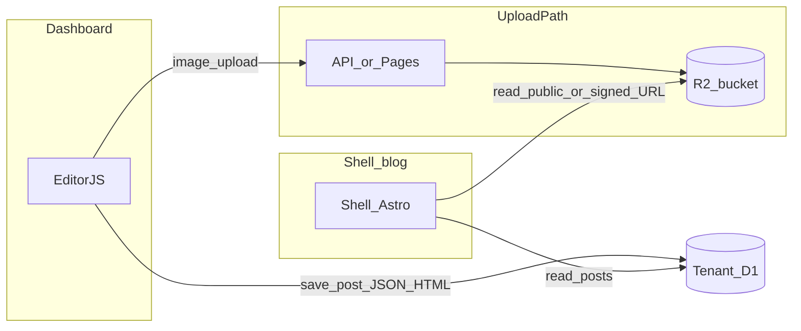

# Sprint planı — test kabuğu kapanışı, operasyon, sonraki blog sprint’i

**Amaç:** “Test kabuğu” fazını dokümante kapatmak; güvenlikte **yeni hardcode yok**, kritik davranışlar **env + Cloudflare Dashboard** ile yönetilsin. Ardından **SEO dostu blog + R2 medya** için ayrı sprint özeti (uygulama bu belgenin dışında kodlanır).

**İlgili dosyalar:** [PROJECT-STATUS.md](../PROJECT-STATUS.md), [ENV-VARIABLES-CHECKLIST.md](./ENV-VARIABLES-CHECKLIST.md), [api/README.md](../api/README.md).

---

## A — Test kabuğu kapanışı (operasyon + güvenlik)

### A1 — Env checklist

1. [docs/ENV-VARIABLES-CHECKLIST.md](./ENV-VARIABLES-CHECKLIST.md) dosyasını açın.
2. **API Worker** ve **Landing Pages** tablolarında her satır için Production (ve gerekiyorsa Preview) ortamında değerin tanımlı olduğunu doğrulayıp kutuları işaretleyin.
3. **`CORS_ORIGINS`:** Özel landing alanı kullanıyorsanız, Worker’da bu değişkende **yeni `https://…` origin’ini**, ihtiyaç duyduğunuz **mevcut origin’leri birlikte** verin. Boş bırakırsanız kod içi varsayılan liste kullanılır; özel alan listede yoksa tarayıcı CORS hatası verir.
4. **`ALLOWED_EMAILS`:** Davetli beta için dolu; herkese açık test için boş/tanımsız — kararı tek ortam politikası olarak netleştirin.

### A2 — Rate limiting (Dashboard + Worker binding)

**API hostname kararı:** Özel API domain’i **zorunlu değil**; Snappost şu an **`*.workers.dev`** ile devam ediyor — bu yeterli. İleride marka, müşteri beklentisi veya zone üzerinden WAF/rate limit yazmayı kolaylaştırmak isterseniz Worker’a `api.example.com` gibi bir route eklenebilir.

**Worker (repoda):** `wrangler.toml` içinde [Rate Limit binding](https://developers.cloudflare.com/workers/runtime-apis/bindings/rate-limit/) — kayıt **5/dk**, giriş **10/dk**, provision **3/dk** (PoP başına; anahtar: kayıt/girişte IP, provision’da `userId`). **Wrangler ≥ 4.36** gerekir (`api/package.json`). Limitler yalnızca `wrangler.toml` ile değişir; binding yoksa kod atlar (`RL_*` opsiyonel).

**Panel (öneri):** Hesap/planınıza göre `workers.dev` veya zone hostname için WAF / rate rules — Worker limitleriyle **birlikte** veya ek katman olarak.

Cloudflare hesabınızda API Worker’ınızın geldiği hostname’i kullanın (ör. `https://snappost-api.<subdomain>.workers.dev`). Tam menü adları plana göre değişebilir; genel akış:

1. **Cloudflare Dashboard** → ilgili **hesap** → **Workers & Pages** → **snappost-api** (veya Worker adınız) → **Settings** / **Triggers** ile route’u doğrulayın.
2. **Security** → **WAF** veya **Rate limiting** (hesap planınıza göre “Rate rules”, “Custom rules” vb.) bölümüne gidin.
3. **Hedef:** Aşağıdaki path’ler için **kaynak IP** başına eşik (örnek başlangıç değerleri — trafiğe göre sıkılaştırın):
   - `POST` path içinde `/api/auth/register` — örn. **5 istek / dakika / IP**
   - `POST` path içinde `/api/auth/login` — örn. **10 istek / dakika / IP**
   - `POST` path içinde `/api/provision` — örn. **3 istek / dakika / IP** (provision pahalıdır)
4. Kural eşlemesinde **URI Path** veya **HTTP Request URI** koşullarını kullanın; metodu `POST` ile sınırlayın.
5. **Not:** Panel kuralları ücretli özelliklere bağlı olabilir. Worker tarafı `api/wrangler.toml` `[[ratelimits]]` ile ayrıca uygulanır.

### A3 — Production hijyen

- Production Worker’da **`ALLOW_TEST_ROUTES`** tanımlı olmasın (`/test/*` yanıt vermesin → **404**).
- **`CF_API_TOKEN`**, **`JWT_SECRET`** repoda ve public `[vars]` içinde olmasın; yalnızca secret veya güvenli kanal.
- **`docs/ENV-VARIABLES-CHECKLIST.md`** ile son bir kez go/no-go.

**Test kabuğu kapanış cümlesi (kopyala-yapıştır):**  
*Snappost test kabuğu: auth + provision + landing dashboard; whitelist/limit/CORS env tabanlı; production’da `/test/*` kapalı; CF panelde rate limit kuralları tanımlandı (veya bilinçli erteleme notu düşüldü); duman testleri geçti. Sonraki kod sprint’i: blog içerik + SEO + R2 medya.*

---

## B — Sonraki sprint: SEO dostu blog + medya (R2)

**Hedef:** Kiracı **shell** blogunda hızlı yüklenen sayfa; yazı başına **title, description, canonical, Open Graph**; içerikte **görsel** (R2’de saklanan, güvenli URL ile).

| # | İş | Not |
|---|-----|-----|
| B1 | R2 bucket | **Yapıldı:** bucket `snappost-media`, binding `MEDIA_BUCKET`, prefix `u{userId}/s{siteId}/…` — [`api/src/lib/media-keys.ts`](../api/src/lib/media-keys.ts), `GET /api/media/status`. |
| B2 | Upload / imza | **Yapıldı (MVP):** `POST /api/sites/:id/media` (multipart `file`), MIME allowlist + `MAX_MEDIA_UPLOAD_MB`; public `GET /api/media/raw/:enc`; site silinince R2 prefix temizliği. İmzalı URL / doğrudan R2 domain sonraki iyileştirme. |
| B3 | Editor.js Image | **Yapıldı:** `@editorjs/image`, `POST /api/upload-media` → API `access_token` proxy; `renderEditorJSToHTML` `image` + `figure`/`loading="lazy"`; provision `SNAPPOST_*` + önce `sites` satırı. API: `SNAPPOST_API_PUBLIC_URL` (önerilir). |
| B4 | Shell render | **Yapıldı:** `[slug].astro` → `shellPostBodyHtml` (`content_html` + yedek Editor.js / markdown), tüm `` için `loading`/`decoding`; typography `prose` ile figure/görsel. |
| B5 | SEO | **Yapıldı:** `Base` + `SeoHead` (canonical, `og:*`, Twitter summary, RSS `link`, yazıda JSON-LD `BlogPosting`); `rss.xml` gerçek kök + XML kaçışı; provision shell **`SITE_URL`**. Özel domain: Pages’de `SITE_URL`’ü blog hostname’ine güncelleyin. |
| B6 | Performans | **Yapıldı:** Dashboard CDN Tailwind kaldırıldı → derlenmiş Tailwind + daisyUI; Editor script’leri body’de vendor sırası; shell `enhanceArticleImages` (`sizes`, ilk görsel LCP); API `recommended_image_max_edge_px` (`GET /api/media/status`). |
| B7 | Dağıtım hattı | **Yapıldı (netleştirildi):** aşağıdaki **§B7** + `api` içinde `templates:ship` / `sync-templates`; PROJECT-STATUS **§7** güncellendi. |

### B7 — Kiracı şablon dağıtım hattı (shell + dashboard)

**Amaç:** `POST /api/provision` yalnızca **API Worker içine gömülü** paketi Direct Upload eder; kaynak `templates/*` repo içinde kalır, üretim yolu şu sırayla tanımlıdır:

1. **Kaynak:** `templates/shell/src/...`, `templates/dashboard/src/...` (Astro + Tailwind vb.).
2. **Build:** Her projede `npm run build` → `templates/{shell,dashboard}/dist/`.
3. **Kopya:** `dist/` → `api/src/templates/{shell,dashboard}/` — **`npm run sync-templates`** (`api/scripts/sync-templates.mjs`; hedefi silip kopyalar, hash drift’i önler).
4. **Gömme:** `cd api && npm run embed` → `api/src/generated/shell-template.ts`, `dashboard-template.ts` (base64 + worker bundle).
5. **API deploy:** `cd api && wrangler deploy`.
6. **Git:** `api/src/templates/*` ve `api/src/generated/*` **commitlenir**; aksi halde CI/production eski gömülü paketle kalır.

**Tek komut (öneri):** `cd api && npm run templates:ship` (= build + sync + embed). Sonra `wrangler deploy`.

**Yeni vs mevcut kiracı:** Provision **yalnızca deploy anındaki gömülü şablonu** kullanır. **Zaten oluşmuş** `sp-*-shell` / `sp-*-dash` Pages projeleri **otomatik güncellenmez** (bkz. PROJECT-STATUS §8 limitasyon ~template upgrade). Yeni şablonu almak için operasyonel seçenekler: yeniden provision, elle Pages redeploy veya ileride ayrı “upgrade” aracı.

**Sabit projeler:** `landing` ve `api` kendi `wrangler`/Git akışlarıyla deploy edilir; B7 hattı **kiracı şablonları** içindir.



### B8 — MVP sonrası (şimdilik yok)

- **API kullanım rehberi / geliştirici UI:** MVP ve öğrenme aşamasında **öncelik değil**; CF Dashboard + `api/README.md` + `PROJECT-STATUS.md` §4 yeterli. Harici tüketim veya ortak geliştirici kitlesi gerekince: OpenAPI + tek sayfa doküman veya `api.*` altında statik docs.

### B sprint kapanışı (blog + medya + dağıtım)

**Özet:** B1–B7 tamamlandı (R2, upload, Editor görsel, shell render, SEO, performans, şablon hattı `templates:ship`).

**Operatör kontrol listesi (kısa):**

1. [ENV-VARIABLES-CHECKLIST.md](./ENV-VARIABLES-CHECKLIST.md) — API, landing, kiracı dashboard/shell `SITE_URL` / `SNAPPOST_*` / `SNAPPOST_API_PUBLIC_URL` vb.
2. Şablon kaynağı değiştiyse: `cd api && npm run templates:ship`, **`wrangler deploy`**, `api/src/templates/*` + `api/src/generated/*` commit (§B7).
3. Duman: §C2 (`npm run smoke`); production’da `/test/*` **404** (§A3).

**Sonraki ürün/teknik işler** (öncelik sırası sizin için): [PROJECT-STATUS.md](../PROJECT-STATUS.md) **§9.2** (stabilizasyon: dashboard şifresi provision’da, panel rate limit, abuse), **§9.3** (ölçekleme pivot), **§9.4** (V3).

---

## C — Duman testleri

### C1 — Manuel kontrol listesi

| # | Adım | Beklenen |
|---|------|----------|
| T1 | `GET /` (API kökü) | `200`, JSON `status: ok` |
| T1b | `GET /api/media/status` | `200`, JSON’da `r2: true`, `recommended_image_max_edge_px` (pozitif sayı); otomatik smoke aynı doğrulamayı yapar |
| T2 | `GET /api/sites` (Authorization yok) | `401` |
| T3 | `POST /api/auth/register` — whitelist **kapalı**, geçerli body | `200` veya mevcut kullanıcıda `409` |
| T4 | `POST /api/auth/register` — whitelist **açık**, listede olmayan e-posta | `403`, anlama uygun `error` |
| T5 | `POST /api/auth/login` — doğru kimlik | `200` + token |
| T6 | `GET /api/auth/me` — Bearer | `200` |
| T7 | `POST /api/provision` — Bearer + `site_name` | `200` veya CF hatasında `5xx` + rollback beklentisi |
| T7a | Aynı kullanıcı + aynı `site_name` ile ikinci provision | `409`, `error` blog adı kullanılıyor |
| T8 | `MAX_SITES_PER_USER` dolu iken limit üstü provision | `403`, `detail` |
| T9 | Tarayıcıdan landing → API (kayıt/giriş); özel domain varsa `CORS_ORIGINS` | Preflight ve istek başarılı |
| T10 | `DELETE /api/sites/:id` — onaylı silme | `200`, liste güncellenir |
| T11 | Production’da `GET …/test/d1` (veya herhangi `/test/*`) | `404` (`ALLOW_TEST_ROUTES` kapalı) |

Endpoint özeti: [PROJECT-STATUS.md](../PROJECT-STATUS.md) §4.

### C2 — Otomatik script

```bash
export SMOKE_API_URL="https://snappost-api.<subdomain>.workers.dev"
# İsteğe bağlı — token alıp korumalı uç test eder:
# export SMOKE_EMAIL="you@example.com"
# export SMOKE_PASSWORD="yourpassword"
# İsteğe bağlı — T7a: bu hesapta zaten kayıtlı bir site_name (yeni provision oluşturmaz):
# export SMOKE_DUP_SITE_NAME="my-blog"
cd api && npm run smoke
```

Ayrıntı: [api/scripts/smoke-api.sh](../api/scripts/smoke-api.sh). Otomatik paket: T1 (`GET /` → `status: ok`), T1b, T2, register `{}`, `/test/*` → 404; isteğe bağlı login/sites, `SMOKE_DUP_SITE_NAME` (T7a). Secret’ları repoya yazmayın; yalnızca env veya CI secret kullanın.
